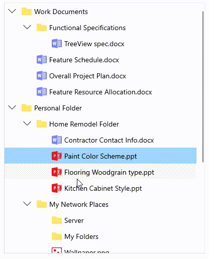

# How to edit an item in WinUI Treeview?

## About the sample

This example describes how to edit an item in WinUI Treeview.

[WinUI TreeView](https://www.syncfusion.com/winui-controls/treeview) (SfTreeView) provides support for editing and it can be enabled or disabled by using [SfTreeView.AllowEditing](https://help.syncfusion.com/cr/winui/Syncfusion.UI.Xaml.TreeView.SfTreeView.html#Syncfusion_UI_Xaml_TreeView_SfTreeView_AllowEditing) property. You can enter edit mode in a node by pressing **F2** key only. The editing changes in a node will be committed only when user move to next node or pressing **Enter** key.

It is necessary to define [EditTemplate](https://help.syncfusion.com/cr/winui/Syncfusion.UI.Xaml.TreeView.SfTreeView.html#Syncfusion_UI_Xaml_TreeView_SfTreeView_EditTemplate) / [EditTemplateSelector](https://help.syncfusion.com/cr/winui/Syncfusion.UI.Xaml.TreeView.SfTreeView.html#Syncfusion_UI_Xaml_TreeView_SfTreeView_EditTemplateSelector) for bound mode, to enable editing. For UnboundMode, textbox will be loaded in edit mode by default.

``` XML

<treeView:SfTreeView   x:Name="treeView"
                       Width="400"
                       Height="500"
                       AllowEditing="True"
                       AutoExpandMode="AllNodes"
                       ChildPropertyName="Childs"
                       BorderBrush="LightGray"
                       IsAnimationEnabled="True"
                       BorderThickness="1"
                       FullRowSelect="True"
                       ItemsSource="{Binding Nodes1}">
            <treeView:SfTreeView.ItemTemplate>
                <DataTemplate>
                    <StackPanel Orientation="Horizontal">
                        <ContentPresenter Width="20"
                                          Height="20"
                                          HorizontalAlignment="Stretch"
                                          VerticalAlignment="Center"
                                          ContentTemplate="{Binding ImageTemplate}" />
                        <TextBlock
                                          Margin="5"
                                          VerticalAlignment="Center"
                                          Text="{Binding Header}" />
                    </StackPanel>
                </DataTemplate>
            </treeView:SfTreeView.ItemTemplate>
            <treeView:SfTreeView.EditTemplate>
                <DataTemplate>
                    <TextBox VerticalAlignment="Center" 
                             Height="{Binding Path=ItemHeight,ElementName=treeView}" 
                             BorderThickness="1" 
                             Text="{Binding Header,Mode=TwoWay}"/>
                </DataTemplate>
            </treeView:SfTreeView.EditTemplate>
</treeView:SfTreeView>

```



## Programmatic Editing

### Begin the editing

WinUI TreeView allows you to edit the node programmatically by calling the [BeginEdit](https://help.syncfusion.com/cr/winui/Syncfusion.UI.Xaml.TreeView.SfTreeView.html#Syncfusion_UI_Xaml_TreeView_SfTreeView_BeginEdit_Syncfusion_UI_Xaml_TreeView_TreeViewNode_) method.
            
``` C#

this.treeView.Loaded += OnLoaded;

private void OnLoaded(object sender, RoutedEventArgs e)
{
    this.treeView.BeginEdit(this.treeView.Nodes[0]);
}

```

#### NOTE: [CurrentItem](https://help.syncfusion.com/cr/winui/Syncfusion.UI.Xaml.TreeView.SfTreeView.html#Syncfusion_UI_Xaml_TreeView_SfTreeView_CurrentItem) is set to the node when the BeginEdit is called.

### End the editing

You can call [EndEdit](https://help.syncfusion.com/cr/winui/Syncfusion.UI.Xaml.TreeView.SfTreeView.html#Syncfusion_UI_Xaml_TreeView_SfTreeView_EndEdit_Syncfusion_UI_Xaml_TreeView_TreeViewNode_) method to programmatically end the editing for specific node.
      
``` C#

this.treeView.Loaded += OnLoaded;

private void OnLoaded(object sender, RoutedEventArgs e)
{
    this.treeView.EndEdit(this.treeView.Nodes[0]);
}

```

## Revert the edited changes while pressing Escape key

WinUI TreeView does not have support for rollback the changes when pressing the **ESC** key while editing the TreeView node. But it supports to rollback the changes when an underlying data object implements the [IEditableObject](https://docs.microsoft.com/en-us/dotnet/api/system.componentmodel.ieditableobject?view=net-6.0) interface.

The user can take a backup of existing data of a node in the [BeginEdit](https://docs.microsoft.com/en-us/dotnet/api/system.componentmodel.ieditableobject.beginedit?view=net-6.0) method and can change the existing data to the current data in the [CancelEdit](https://docs.microsoft.com/en-us/dotnet/api/system.componentmodel.ieditableobject.canceledit?view=net-6.0) method to rollback the changes.

The below code snippet explains the simple implementation of IEditableObject interface to rollback the changes.

``` C#

public class EditingModel : INotifyPropertyChanged, IEditableObject
{
        #region Fields

        private string name;
        internal EditingModel backUpData;
        private EditingModel currentData;

        private string header = string.Empty;
        private bool isexpanded = true;
        private DataTemplate imageTemplate;
        private ObservableCollection<EditingModel> childs = null;

        #endregion

        #region Constructor

        public EditingModel()
        {
            
        }

        public EditingModel(string name):base()
        {
            Childs = new ObservableCollection<EditingModel>();
            this.currentData = new EditingModel();
            this.currentData.name = name;
        }

        #endregion

        #region Properties
        public string Header
        {
            get
            {
                return currentData.name;
            }
            set
            {
                currentData.name = value;
                this.RaisePropertyChanged("Header");
            }
        }

        public bool IsExpanded
        {
            get
            {
                return isexpanded;
            }
            set
            {
                isexpanded = value;
                this.RaisePropertyChanged("IsExpanded");
            }
        }
        
        public DataTemplate ImageTemplate
        {
            get { return imageTemplate; }
            set { imageTemplate = value; }
        }

        public ObservableCollection<EditingModel> Childs
        {
            get
            {
                return childs;
            }
            set
            {
                childs = value;
                this.RaisePropertyChanged("Childs");
            }
        }

        #endregion

        #region INotifyPropertyChanged

        public event PropertyChangedEventHandler PropertyChanged;

        public void RaisePropertyChanged(string _PropertyName)
        {
            if (PropertyChanged != null)
            {
                PropertyChanged(this, new PropertyChangedEventArgs(_PropertyName));
            }
        }

        #endregion

        #region IEditableObject

        public void BeginEdit()
        {
            backUpData = new EditingModel();
            backUpData.name = this.currentData.name;
        }
        
        public void EndEdit()
        {
            
        }

        public void CancelEdit()
        {
            this.currentData = backUpData;
        }
        
        #endregion
}

```


Take a moment to peruse the [WinUI TreeView - Editing](https://help.syncfusion.com/winui/treeview/editing) documentation, where you can find about editing with code examples.

## Requirements to run the demo
Visual Studio 2019 and above versions
